# Fundación Lucky Bienestar Animal — Documentación DB V1.2

## Objetivo del ajuste

Este documento corrige y completa la documentación de base de datos para la PWA pública, el Backoffice CRM y los servicios de Supabase de Fundación Lucky Bienestar Animal.

El cambio principal de esta versión es que `profiles` **ya no contiene** el campo `has_volunteer_badge`. Ese campo era demasiado específico y quemaba una insignia fija dentro del perfil del usuario. Ahora las insignias se modelan correctamente con dos tablas:

```txt
badges       = catálogo de insignias disponibles
user_badges  = insignias obtenidas por cada usuario
```

De esta forma un mismo usuario puede tener varias insignias durante su vida en la plataforma, por ejemplo:

- Voluntario Lucky.
- Adoptante Lucky.
- Apadrinador Lucky, preparado para V2.
- Cualquier badge futuro sin modificar la tabla `profiles`.

## Regla de diseño aplicada

```txt
profiles = datos base del usuario
avatar_options = avatares precargados seleccionables
badges = catálogo de insignias
user_badges = relación usuario-insignia con trazabilidad
```

`profiles` queda limpio. No debe tener columnas como:

```txt
has_volunteer_badge
has_adopter_badge
has_sponsor_badge
```

---

# Mermaid general actualizado

```mermaid
erDiagram
    AUTH_USERS ||--|| PROFILES : "tiene perfil"
    AVATAR_OPTIONS ||--o{ PROFILES : "avatar seleccionado"

    PROFILES ||--o{ USER_ROLES : "tiene roles"
    ROLES ||--o{ USER_ROLES : "se asigna"
    ROLES ||--o{ ROLE_PERMISSIONS : "agrupa permisos"
    PERMISSIONS ||--o{ ROLE_PERMISSIONS : "define acciones"

    PROFILES ||--o{ USER_BADGES : "obtiene badges"
    BADGES ||--o{ USER_BADGES : "se asigna"

    PROFILES ||--o{ MEDIA_ASSETS : "sube archivos"

    MEDIA_ASSETS ||--o{ LANDING_SECTIONS : "imagen principal"
    LANDING_SECTIONS ||--o{ HERO_CARDS : "contiene"
    LANDING_SECTIONS ||--o{ LANDING_IMPACT_BLOCKS : "bloques impacto"
    LANDING_SECTIONS ||--o{ LANDING_INFO_CARDS : "cards informativas"

    PUBLICATION_CATEGORIES ||--o{ PUBLICATIONS : "clasifica"
    MEDIA_ASSETS ||--o{ PUBLICATIONS : "portada"
    PROFILES ||--o{ PUBLICATIONS : "crea"

    PROFILES ||--o{ ANIMAL_PROFILES : "registra"
    ANIMAL_PROFILES ||--o{ ANIMAL_IMAGES : "tiene imagenes"
    MEDIA_ASSETS ||--o{ ANIMAL_IMAGES : "archivo"
    ANIMAL_PROFILES ||--o{ ANIMAL_CHARACTERISTICS : "caracteristicas"
    ANIMAL_PROFILES ||--o{ ADOPTION_APPLICATIONS : "recibe solicitudes"

    PROFILES ||--o{ ADOPTION_APPLICATIONS : "envia solicitud"
    HOUSING_TYPES ||--o{ ADOPTION_APPLICATIONS : "tipo vivienda"
    ADOPTION_APPLICATIONS ||--o{ ADOPTION_STATUS_HISTORY : "timeline"
    ADOPTION_APPLICATIONS ||--o{ TERMS_ACCEPTANCES : "aceptacion terminos"
    ADOPTION_APPLICATIONS ||--o{ COMMUNICATION_LOGS : "comunicaciones"

    PROFILES ||--o{ VOLUNTEER_APPLICATIONS : "envia solicitud"
    VOLUNTEER_APPLICATIONS ||--o{ VOLUNTEER_APPLICATION_STATUS_HISTORY : "timeline"
    VOLUNTEER_APPLICATIONS ||--o{ VOLUNTEER_PROFILES : "origina voluntario"
    VOLUNTEER_APPLICATIONS ||--o{ TERMS_ACCEPTANCES : "aceptacion terminos"
    VOLUNTEER_APPLICATIONS ||--o{ COMMUNICATION_LOGS : "comunicaciones"

    TERMS_DOCUMENTS ||--o{ TERMS_ACCEPTANCES : "version aceptada"
    PROFILES ||--o{ TERMS_ACCEPTANCES : "acepta"

    PROFILES ||--o{ USER_NOTIFICATIONS : "recibe"
    PROFILES ||--o{ COMMUNICATION_LOGS : "recibe mensaje"

    AUTH_USERS {
        uuid id PK
        string email
    }

    PROFILES {
        uuid id PK
        uuid avatar_id FK
        string first_names
        string last_names
        string phone
        date birth_date
        string address
        string housing_sector
        string status
        string user_type
        datetime created_at
        datetime updated_at
    }

    AVATAR_OPTIONS {
        uuid id PK
        string key UK
        string name
        string image_url
        boolean is_default
        boolean is_active
        int order_index
    }

    ROLES {
        string key PK
        string name
        string description
        boolean is_internal
    }

    PERMISSIONS {
        string key PK
        string module
        string description
    }

    ROLE_PERMISSIONS {
        string role_key FK
        string permission_key FK
    }

    USER_ROLES {
        uuid id PK
        uuid user_id FK
        string role_key FK
        uuid assigned_by FK
        boolean is_active
    }

    BADGES {
        uuid id PK
        string key UK
        string name
        string description
        string icon
        boolean is_active
        int order_index
    }

    USER_BADGES {
        uuid id PK
        uuid user_id FK
        uuid badge_id FK
        string source_module
        uuid source_id
        datetime awarded_at
        uuid awarded_by FK
    }

    MEDIA_ASSETS {
        uuid id PK
        string bucket
        string path
        string public_url
        string alt_text
        string media_type
        uuid uploaded_by FK
    }

    LANDING_SECTIONS {
        uuid id PK
        string key UK
        string title
        string highlighted_text
        text subtitle
        uuid main_media_id FK
        boolean is_active
        int order_index
    }

    HERO_CARDS {
        uuid id PK
        uuid section_id FK
        string title
        text description
        string icon
        string cta_label
        string cta_href
        boolean is_active
        int order_index
    }

    LANDING_IMPACT_BLOCKS {
        uuid id PK
        uuid section_id FK
        string prefix_text
        int metric_value
        string suffix_text
        text description
        string icon
        string cta_label
        string cta_href
        boolean is_active
        int order_index
    }

    LANDING_INFO_CARDS {
        uuid id PK
        uuid section_id FK
        string title
        text description
        string icon
        string cta_label
        string cta_href
        boolean is_active
        int order_index
    }

    PUBLICATION_CATEGORIES {
        uuid id PK
        string name
        string slug UK
        text description
        boolean is_active
        int order_index
    }

    PUBLICATIONS {
        uuid id PK
        uuid category_id FK
        uuid cover_media_id FK
        uuid created_by FK
        string title
        string slug UK
        text subtitle
        text description
        text content
        string type
        string status
        string featured_section
        date event_date
        string date_label
        string cta_label
        boolean is_featured
        boolean is_active
        int order_index
        datetime published_at
    }

    ANIMAL_PROFILES {
        uuid id PK
        uuid created_by FK
        string name
        string slug UK
        string species
        string sex
        string size
        string age_label
        string status
        boolean is_sterilized
        text description
        boolean is_featured
        boolean is_active
        int order_index
    }

    ANIMAL_IMAGES {
        uuid id PK
        uuid animal_id FK
        uuid media_id FK
        boolean is_primary
        int order_index
    }

    ANIMAL_CHARACTERISTICS {
        uuid id PK
        uuid animal_id FK
        string label
        int order_index
        boolean is_active
    }

    HOUSING_TYPES {
        uuid id PK
        string key UK
        string name
        text description
        boolean requires_other_detail
        boolean is_active
        int order_index
    }

    ADOPTION_APPLICATIONS {
        uuid id PK
        uuid user_id FK
        uuid animal_id FK
        uuid housing_type_id FK
        text housing_other_detail
        text adoption_reason
        string status
        uuid reviewed_by FK
        text review_message
        datetime submitted_at
        datetime reviewed_at
        datetime process_started_at
        datetime completed_at
    }

    ADOPTION_STATUS_HISTORY {
        uuid id PK
        uuid application_id FK
        string previous_status
        string new_status
        text message
        uuid changed_by FK
        datetime created_at
    }

    VOLUNTEER_REQUIREMENTS {
        uuid id PK
        string title
        text description
        string type
        boolean is_required
        boolean is_active
        int order_index
    }

    VOLUNTEER_APPLICATIONS {
        uuid id PK
        uuid user_id FK
        text motivation
        string availability_type
        string status
        boolean is_adult_confirmed
        uuid reviewed_by FK
        text review_message
        datetime submitted_at
        datetime reviewed_at
    }

    VOLUNTEER_APPLICATION_STATUS_HISTORY {
        uuid id PK
        uuid application_id FK
        string previous_status
        string new_status
        text message
        uuid changed_by FK
        datetime created_at
    }

    VOLUNTEER_PROFILES {
        uuid id PK
        uuid user_id FK
        uuid approved_application_id FK
        string status
        datetime approved_at
        uuid approved_by FK
    }

    TERMS_DOCUMENTS {
        uuid id PK
        string title
        text content
        string type
        int version
        boolean is_active
        datetime published_at
    }

    TERMS_ACCEPTANCES {
        uuid id PK
        uuid user_id FK
        uuid terms_id FK
        uuid adoption_application_id FK
        uuid volunteer_application_id FK
        datetime accepted_at
    }

    USER_NOTIFICATIONS {
        uuid id PK
        uuid user_id FK
        string title
        text message
        string type
        string related_module
        uuid related_id
        boolean is_read
        datetime read_at
        datetime created_at
    }

    COMMUNICATION_LOGS {
        uuid id PK
        uuid user_id FK
        uuid adoption_application_id FK
        uuid volunteer_application_id FK
        string channel
        string subject
        text message
        string status
        uuid sent_by FK
        datetime created_at
    }

    CONTACT_INFO {
        uuid id PK
        string whatsapp_number
        string phone_label
        string email
        text address
        text map_embed_url
        text google_maps_url
        boolean is_active
    }

    SOCIAL_LINKS {
        uuid id PK
        string platform
        string label
        text url
        string icon
        boolean is_active
        int order_index
    }

    FAQ_ITEMS {
        uuid id PK
        string question
        text answer
        string category
        boolean is_active
        int order_index
    }
```



---

# Diccionario de datos

## Convenciones generales

| Convención | Descripción |
|---|---|
| `id` | Identificador único de la tabla. Generalmente UUID. |
| `created_at` | Fecha de creación del registro. |
| `updated_at` | Fecha de última actualización. Se actualiza con trigger `update_updated_at_column()`. |
| `deleted_at` | Campo para borrado lógico. Si tiene valor, el registro se considera eliminado. |
| `is_active` | Controla si el registro está activo y visible según su contexto. |
| `order_index` | Permite ordenar registros en la UI. |
| `status` | Estado funcional del registro. Sus valores dependen de cada tabla. |
| `source_module` | Módulo que originó una acción o asignación. Ejemplo: `volunteering`, `adoption`, `sponsorship`. |
| `source_id` | ID del registro que originó una acción o asignación. |

---

# 1. Identidad, avatares, roles, permisos y badges

## 1.1. `auth.users` — Supabase Auth

Tabla administrada internamente por Supabase Auth. No se crea ni se modifica directamente desde nuestro esquema público.

| Campo | Tipo | Clave | Descripción |
|---|---|---|---|
| `id` | UUID | PK | Identificador real del usuario autenticado en Supabase. |
| `email` | String |  | Correo usado para login y recuperación de cuenta. |

### Uso

Supabase Auth maneja credenciales, contraseñas, sesiones, tokens y recuperación de contraseña. Nuestro sistema extiende esa identidad mediante `profiles`.

---

## 1.2. `avatar_options`

Catálogo de avatares precargados. Los usuarios no subirán foto personal; elegirán uno de estos avatares. Si no seleccionan ninguno, se asigna el avatar default.

| Campo | Tipo | Clave / Restricción | Descripción |
|---|---|---|---|
| `id` | UUID | PK | Identificador del avatar. |
| `key` | String | UK | Código interno del avatar. Ejemplo: `lucky_default`, `lucky_01`. |
| `name` | String | NOT NULL | Nombre visible o administrativo del avatar. |
| `image_url` | Text | NOT NULL | Ruta o URL del avatar. |
| `is_default` | Boolean | Único cuando es `true` y no está eliminado | Indica si es el avatar asignado por defecto. |
| `is_active` | Boolean | Default `true` | Define si puede ser seleccionado. |
| `order_index` | Integer | Default `0` | Orden visual en el selector de avatar. |
| `created_at` | Timestamp |  | Fecha de creación. |
| `updated_at` | Timestamp |  | Fecha de actualización. |
| `deleted_at` | Timestamp |  | Borrado lógico. |

---

## 1.3. `profiles`

Perfil extendido del usuario. Se relaciona uno a uno con `auth.users`. No guarda contraseña ni fotos subidas por el usuario.

| Campo | Tipo | Clave / Restricción | Descripción |
|---|---|---|---|
| `id` | UUID | PK / FK `auth.users(id)` | Mismo ID del usuario en Supabase Auth. |
| `avatar_id` | UUID | FK `avatar_options(id)` | Avatar seleccionado por el usuario. |
| `first_names` | String |  | Nombres del usuario. |
| `last_names` | String |  | Apellidos del usuario. |
| `phone` | String |  | Teléfono o WhatsApp del usuario. |
| `birth_date` | Date |  | Fecha de nacimiento. Se usa para validar mayoría de edad. |
| `address` | Text |  | Dirección registrada por el usuario. |
| `housing_sector` | String |  | Sector, barrio o zona de vivienda. |
| `status` | String | Check: `active`, `inactive`, `blocked` | Estado de la cuenta dentro de la plataforma. |
| `user_type` | String | Check: `public`, `staff` | Define si es usuario público o personal interno. |
| `created_at` | Timestamp |  | Fecha de creación. |
| `updated_at` | Timestamp |  | Fecha de actualización. |
| `deleted_at` | Timestamp |  | Borrado lógico. |

### Nota clave

`profiles` no contiene `has_volunteer_badge`. Las insignias se consultan desde `user_badges`.

---

## 1.4. `roles`

Catálogo de roles del sistema.

| Campo | Tipo | Clave / Restricción | Descripción |
|---|---|---|---|
| `key` | String | PK | Código del rol. Ejemplo: `admin`, `operator`, `public_user`. |
| `name` | String | NOT NULL | Nombre visible del rol. |
| `description` | Text |  | Descripción de responsabilidades. |
| `is_internal` | Boolean | Default `false` | Indica si es un rol interno de Backoffice. |
| `created_at` | Timestamp |  | Fecha de creación. |

| Rol | Uso |
|---|---|
| `admin` | Control total del CRM. |
| `operator` | Gestión operativa. |
| `public_user` | Usuario normal registrado desde landing. |

---

## 1.5. `permissions`

Catálogo de permisos o acciones del sistema.

| Campo | Tipo | Clave / Restricción | Descripción |
|---|---|---|---|
| `key` | String | PK | Código del permiso. Ejemplo: `animals.manage`, `adoption.apply`. |
| `module` | String | NOT NULL | Módulo al que pertenece el permiso. |
| `description` | Text | NOT NULL | Descripción funcional del permiso. |
| `created_at` | Timestamp |  | Fecha de creación. |

---

## 1.6. `role_permissions`

Relación muchos a muchos entre roles y permisos.

| Campo | Tipo | Clave / Restricción | Descripción |
|---|---|---|---|
| `role_key` | String | PK compuesta / FK `roles(key)` | Rol que recibe el permiso. |
| `permission_key` | String | PK compuesta / FK `permissions(key)` | Permiso asignado al rol. |
| `created_at` | Timestamp |  | Fecha de asignación. |

---

## 1.7. `user_roles`

Roles asignados a usuarios específicos.

| Campo | Tipo | Clave / Restricción | Descripción |
|---|---|---|---|
| `id` | UUID | PK | Identificador de la asignación. |
| `user_id` | UUID | FK `profiles(id)` | Usuario que recibe el rol. |
| `role_key` | String | FK `roles(key)` | Rol asignado. |
| `assigned_by` | UUID | FK `profiles(id)` | Usuario interno que asignó el rol. |
| `is_active` | Boolean | Default `true` | Permite activar o desactivar una asignación. |
| `created_at` | Timestamp |  | Fecha de asignación. |

---

## 1.8. `badges`

Catálogo de insignias obtenibles dentro de la plataforma.

| Campo | Tipo | Clave / Restricción | Descripción |
|---|---|---|---|
| `id` | UUID | PK | Identificador de la insignia. |
| `key` | String | UK | Código interno. Ejemplo: `volunteer`, `adopter`, `sponsor`. |
| `name` | String | NOT NULL | Nombre visible de la insignia. |
| `description` | Text |  | Explica cómo se obtiene la insignia. |
| `icon` | String |  | Nombre del ícono usado en la UI. Ejemplo: `HandHeart`. |
| `is_active` | Boolean | Default `true` | Define si la insignia puede asignarse. |
| `order_index` | Integer | Default `0` | Orden visual de presentación. |
| `created_at` | Timestamp |  | Fecha de creación. |
| `updated_at` | Timestamp |  | Fecha de actualización. |
| `deleted_at` | Timestamp |  | Borrado lógico. |

### Valores iniciales

| `key` | Nombre | Uso |
|---|---|---|
| `volunteer` | Voluntario Lucky | Se asigna cuando una solicitud de voluntariado es aprobada. |
| `adopter` | Adoptante Lucky | Se asigna cuando una adopción culmina exitosamente. |
| `sponsor` | Apadrinador Lucky | Preparado para V2 de apadrinamiento. |

---

## 1.9. `user_badges`

Relación entre usuarios e insignias obtenidas.

| Campo | Tipo | Clave / Restricción | Descripción |
|---|---|---|---|
| `id` | UUID | PK | Identificador de la asignación de badge. |
| `user_id` | UUID | FK `profiles(id)` | Usuario que obtuvo la insignia. |
| `badge_id` | UUID | FK `badges(id)` | Insignia asignada. |
| `source_module` | String |  | Módulo que originó la insignia. Ejemplo: `volunteering`, `adoption`, `sponsorship`. |
| `source_id` | UUID |  | ID del proceso o solicitud que originó la insignia. |
| `awarded_at` | Timestamp | Default actual | Fecha de asignación. |
| `awarded_by` | UUID | FK `profiles(id)` | Usuario interno que otorgó la insignia, si aplica. |

### Ejemplos

| Caso | `source_module` | `source_id` |
|---|---|---|
| Solicitud de voluntariado aprobada | `volunteering` | ID de `volunteer_applications` |
| Adopción culminada | `adoption` | ID de `adoption_applications` |
| Apadrinamiento activo futuro | `sponsorship` | ID del proceso V2 |

---

# 2. Multimedia

## 2.1. `media_assets`

Registro de archivos subidos y usados por la plataforma. Los archivos físicos viven en Supabase Storage; esta tabla guarda metadata.

| Campo | Tipo | Clave / Restricción | Descripción |
|---|---|---|---|
| `id` | UUID | PK | Identificador del archivo. |
| `bucket` | String | UK compuesta con `path` | Bucket de Supabase Storage. |
| `path` | Text | UK compuesta con `bucket` | Ruta interna del archivo. |
| `public_url` | Text |  | URL pública o accesible del archivo. |
| `alt_text` | Text |  | Texto alternativo para accesibilidad. |
| `media_type` | String | Check: `image`, `video`, `document`, `other` | Tipo de archivo. |
| `uploaded_by` | UUID | FK `profiles(id)` | Usuario que subió el archivo. |
| `created_at` | Timestamp |  | Fecha de creación. |
| `updated_at` | Timestamp |  | Fecha de actualización. |
| `deleted_at` | Timestamp |  | Borrado lógico. |

---

# 3. CRM Landing Page

## 3.1. `landing_sections`

Configuración de secciones dinámicas de la landing.

| Campo | Tipo | Clave / Restricción | Descripción |
|---|---|---|---|
| `id` | UUID | PK | Identificador de la sección. |
| `key` | String | UK | Código de sección. Ejemplo: `hero`, `impact`, `faq`, `contact`. |
| `title` | String |  | Título visible de la sección. |
| `highlighted_text` | String |  | Texto destacado. En Hero puede ser “hogar lleno de amor”; en Impacto puede ser “900”. |
| `subtitle` | Text |  | Subtítulo o descripción breve. |
| `main_media_id` | UUID | FK `media_assets(id)` | Imagen principal de la sección. |
| `is_active` | Boolean | Default `true` | Define si la sección se muestra. |
| `order_index` | Integer | Default `0` | Orden de aparición. |
| `created_at` | Timestamp |  | Fecha de creación. |
| `updated_at` | Timestamp |  | Fecha de actualización. |
| `deleted_at` | Timestamp |  | Borrado lógico. |

---

## 3.2. `hero_cards`

Mini cards del Hero.

| Campo | Tipo | Clave / Restricción | Descripción |
|---|---|---|---|
| `id` | UUID | PK | Identificador de la mini card. |
| `section_id` | UUID | FK `landing_sections(id)` | Sección asociada, normalmente `hero`. |
| `title` | String | NOT NULL | Título de la mini card. |
| `description` | Text |  | Texto breve. |
| `icon` | String |  | Ícono funcional. |
| `cta_label` | String |  | Texto de CTA opcional. |
| `cta_href` | Text |  | Enlace del CTA opcional. |
| `is_active` | Boolean | Default `true` | Define si se muestra. |
| `order_index` | Integer | Default `0` | Orden en slider o micro carrusel. |
| `created_at` | Timestamp |  | Fecha de creación. |
| `updated_at` | Timestamp |  | Fecha de actualización. |
| `deleted_at` | Timestamp |  | Borrado lógico. |

---

## 3.3. `landing_impact_blocks`

Bloques de impacto para mensajes como “Somos más de 900 Lucky refugiados”.

| Campo | Tipo | Clave / Restricción | Descripción |
|---|---|---|---|
| `id` | UUID | PK | Identificador del bloque. |
| `section_id` | UUID | FK `landing_sections(id)` | Sección asociada, normalmente `impact`. |
| `prefix_text` | String |  | Texto antes del número. Ejemplo: “Somos más de”. |
| `metric_value` | Integer | Default `0` | Número destacado. Ejemplo: `900`. |
| `suffix_text` | String |  | Texto después del número. Ejemplo: “Lucky refugiados”. |
| `description` | Text |  | Descripción del impacto. |
| `icon` | String |  | Ícono visual. |
| `cta_label` | String |  | Texto de CTA opcional. |
| `cta_href` | Text |  | Enlace del CTA opcional. |
| `is_active` | Boolean | Default `true` | Define si se muestra. |
| `order_index` | Integer | Default `0` | Orden visual. |
| `created_at` | Timestamp |  | Fecha de creación. |
| `updated_at` | Timestamp |  | Fecha de actualización. |
| `deleted_at` | Timestamp |  | Borrado lógico. |

---

## 3.4. `landing_info_cards`

Cards informativas complementarias de landing, por ejemplo visitas de fin de semana.

| Campo | Tipo | Clave / Restricción | Descripción |
|---|---|---|---|
| `id` | UUID | PK | Identificador de la card. |
| `section_id` | UUID | FK `landing_sections(id)` | Sección asociada. |
| `title` | String | NOT NULL | Título de la card. |
| `description` | Text |  | Descripción o mensaje. |
| `icon` | String |  | Ícono visual. |
| `cta_label` | String |  | Texto de CTA opcional. |
| `cta_href` | Text |  | Enlace del CTA opcional. |
| `is_active` | Boolean | Default `true` | Define si se muestra. |
| `order_index` | Integer | Default `0` | Orden visual. |
| `created_at` | Timestamp |  | Fecha de creación. |
| `updated_at` | Timestamp |  | Fecha de actualización. |
| `deleted_at` | Timestamp |  | Borrado lógico. |

---

# 4. Publicaciones, campañas y eventos

## 4.1. `publication_categories`

Categorías de publicaciones, campañas y eventos.

| Campo | Tipo | Clave / Restricción | Descripción |
|---|---|---|---|
| `id` | UUID | PK | Identificador de categoría. |
| `name` | String | NOT NULL | Nombre visible. Ejemplo: Adopciones, Donaciones, Salud. |
| `slug` | String | UK | URL amigable de la categoría. |
| `description` | Text |  | Descripción administrativa. |
| `is_active` | Boolean | Default `true` | Define si se puede usar. |
| `order_index` | Integer | Default `0` | Orden visual. |
| `created_at` | Timestamp |  | Fecha de creación. |
| `updated_at` | Timestamp |  | Fecha de actualización. |
| `deleted_at` | Timestamp |  | Borrado lógico. |

---

## 4.2. `publications`

Entradas utilizadas para campañas, eventos, noticias y contenido de detalle del landing.

| Campo | Tipo | Clave / Restricción | Descripción |
|---|---|---|---|
| `id` | UUID | PK | Identificador de publicación. |
| `category_id` | UUID | FK `publication_categories(id)` | Categoría de la publicación. |
| `cover_media_id` | UUID | FK `media_assets(id)` | Imagen de portada opcional. |
| `created_by` | UUID | FK `profiles(id)` | Usuario interno que creó la publicación. |
| `title` | String | NOT NULL | Título visible. |
| `slug` | String | UK | URL amigable. |
| `subtitle` | Text |  | Subtítulo visible en cards. |
| `description` | Text |  | Descripción resumida. |
| `content` | Text |  | Contenido completo para página detalle. |
| `type` | String | Check: `post`, `campaign`, `event`, `news`, `about` | Tipo de publicación. |
| `status` | String | Check: `draft`, `scheduled`, `published`, `archived` | Estado editorial. |
| `featured_section` | String |  | Sección donde se destaca. Ejemplo: `about`, `campaigns`. |
| `event_date` | Date |  | Fecha real del evento o campaña, si aplica. |
| `date_label` | String |  | Texto visible de fecha. Ejemplo: “Próximo sábado, 10:00 AM”. |
| `cta_label` | String |  | Texto del CTA. Ejemplo: “Ver campaña”. |
| `is_featured` | Boolean | Default `false` | Define si aparece destacada en landing. |
| `is_active` | Boolean | Default `true` | Define si está activa. |
| `order_index` | Integer | Default `0` | Orden visual. |
| `published_at` | Timestamp |  | Fecha de publicación. |
| `created_at` | Timestamp |  | Fecha de creación. |
| `updated_at` | Timestamp |  | Fecha de actualización. |
| `deleted_at` | Timestamp |  | Borrado lógico. |

---

# 5. Animales, adopciones y catálogo

## 5.1. `animal_profiles`

Ficha principal de cada animalito del catálogo.

| Campo | Tipo | Clave / Restricción | Descripción |
|---|---|---|---|
| `id` | UUID | PK | Identificador del animalito. |
| `created_by` | UUID | FK `profiles(id)` | Usuario interno que registró el animalito. |
| `name` | String | NOT NULL | Nombre del animalito. |
| `slug` | String | UK | URL amigable. |
| `species` | String | Check: `dog`, `cat`, `other` | Especie inicial permitida. |
| `sex` | String | Check: `male`, `female`, `unknown` | Sexo del animalito. |
| `size` | String | Check: `small`, `medium`, `large` | Tamaño del animalito. |
| `age_label` | String |  | Edad visible como texto. Ejemplo: “2 años”, “8 meses”. |
| `status` | String | Check: `available`, `in_process`, `sponsored`, `adopted`, `hidden` | Estado público/operativo del animalito. |
| `is_sterilized` | Boolean | Default `true` | Indica si está esterilizado. Por decisión inicial, normalmente será `true`. |
| `description` | Text |  | Descripción general del animalito. Reemplaza el campo historia. |
| `is_featured` | Boolean | Default `false` | Define si aparece en la landing. |
| `is_active` | Boolean | Default `true` | Define si el registro está activo. |
| `order_index` | Integer | Default `0` | Orden en catálogo o landing. |
| `created_at` | Timestamp |  | Fecha de creación. |
| `updated_at` | Timestamp |  | Fecha de actualización. |
| `deleted_at` | Timestamp |  | Borrado lógico. |

### Estados de animal

| Valor | Texto visible | Uso |
|---|---|---|
| `available` | Disponible para adoptar | El animal está listo para recibir solicitudes. |
| `in_process` | En proceso de adopción | La fundación ya está gestionando un proceso. |
| `sponsored` | Apadrinado | Preparado para V2. |
| `adopted` | Adoptado | La adopción culminó. |
| `hidden` | No visible | No se muestra públicamente. |

---

## 5.2. `animal_images`

Imágenes asociadas al animalito. Máximo 3 por animal: 1 principal y hasta 2 secundarias.

| Campo | Tipo | Clave / Restricción | Descripción |
|---|---|---|---|
| `id` | UUID | PK | Identificador de la imagen asociada. |
| `animal_id` | UUID | FK `animal_profiles(id)` | Animal asociado. |
| `media_id` | UUID | FK `media_assets(id)` | Archivo multimedia. |
| `is_primary` | Boolean | Único por animal cuando es `true` | Define la foto principal. |
| `order_index` | Integer | Default `0` | Orden de galería. |
| `created_at` | Timestamp |  | Fecha de creación. |
| `updated_at` | Timestamp |  | Fecha de actualización. |
| `deleted_at` | Timestamp |  | Borrado lógico. |

---

## 5.3. `animal_characteristics`

Características visibles del animalito. Máximo 5 activas por animal.

| Campo | Tipo | Clave / Restricción | Descripción |
|---|---|---|---|
| `id` | UUID | PK | Identificador de la característica. |
| `animal_id` | UUID | FK `animal_profiles(id)` | Animal asociado. |
| `label` | String | NOT NULL | Característica corta. Ejemplo: “Amoroso”, “No tiene una patita”. |
| `order_index` | Integer | Default `0` | Orden visual. |
| `is_active` | Boolean | Default `true` | Define si se muestra. |
| `created_at` | Timestamp |  | Fecha de creación. |
| `updated_at` | Timestamp |  | Fecha de actualización. |
| `deleted_at` | Timestamp |  | Borrado lógico. |

---

# 6. Tipos de vivienda y solicitudes de adopción

## 6.1. `housing_types`

Catálogo de tipos de vivienda para solicitudes de adopción.

| Campo | Tipo | Clave / Restricción | Descripción |
|---|---|---|---|
| `id` | UUID | PK | Identificador del tipo de vivienda. |
| `key` | String | UK | Código interno. |
| `name` | String | NOT NULL | Nombre visible. |
| `description` | Text |  | Explicación del tipo de vivienda. |
| `requires_other_detail` | Boolean | Default `false` | Indica si se debe llenar detalle adicional. Aplica a `other`. |
| `is_active` | Boolean | Default `true` | Define si está disponible en formularios. |
| `order_index` | Integer | Default `0` | Orden visual. |
| `created_at` | Timestamp |  | Fecha de creación. |
| `updated_at` | Timestamp |  | Fecha de actualización. |
| `deleted_at` | Timestamp |  | Borrado lógico. |

---

## 6.2. `adoption_applications`

Solicitud de adopción enviada por un usuario registrado para un animal específico.

| Campo | Tipo | Clave / Restricción | Descripción |
|---|---|---|---|
| `id` | UUID | PK | Identificador de la solicitud. |
| `user_id` | UUID | FK `profiles(id)` | Usuario solicitante. |
| `animal_id` | UUID | FK `animal_profiles(id)` | Animal que desea adoptar. |
| `housing_type_id` | UUID | FK `housing_types(id)` | Tipo de vivienda del solicitante. |
| `housing_other_detail` | Text | Requerido por lógica si vivienda es `other` | Detalle de vivienda cuando aplica. |
| `adoption_reason` | Text | NOT NULL | Razón por la cual desea adoptar. |
| `status` | String | Check: `submitted`, `under_review`, `in_process`, `completed`, `rejected`, `cancelled` | Estado de la solicitud. |
| `reviewed_by` | UUID | FK `profiles(id)` | Usuario interno que revisa. |
| `review_message` | Text |  | Mensaje de feedback al usuario. |
| `submitted_at` | Timestamp | Default actual | Fecha de envío. |
| `reviewed_at` | Timestamp |  | Fecha de revisión. |
| `process_started_at` | Timestamp |  | Fecha en que entra al proceso real de adopción. |
| `completed_at` | Timestamp |  | Fecha de adopción culminada. |
| `created_at` | Timestamp |  | Fecha de creación. |
| `updated_at` | Timestamp |  | Fecha de actualización. |
| `deleted_at` | Timestamp |  | Borrado lógico. |

---

## 6.3. `adoption_status_history`

Historial/timeline de cambios de estado de una solicitud de adopción.

| Campo | Tipo | Clave / Restricción | Descripción |
|---|---|---|---|
| `id` | UUID | PK | Identificador del movimiento. |
| `application_id` | UUID | FK `adoption_applications(id)` | Solicitud relacionada. |
| `previous_status` | String |  | Estado anterior. |
| `new_status` | String | NOT NULL | Nuevo estado. |
| `message` | Text |  | Mensaje o comentario del cambio. |
| `changed_by` | UUID | FK `profiles(id)` | Usuario que realizó el cambio. |
| `created_at` | Timestamp |  | Fecha del cambio. |

---

# 7. Voluntariado

## 7.1. `volunteer_requirements`

Requisitos visibles para postular al voluntariado.

| Campo | Tipo | Clave / Restricción | Descripción |
|---|---|---|---|
| `id` | UUID | PK | Identificador del requisito. |
| `title` | String | NOT NULL | Título del requisito. |
| `description` | Text |  | Explicación del requisito. |
| `type` | String | Check: `material`, `schedule`, `condition`, `other` | Tipo de requisito. |
| `is_required` | Boolean | Default `true` | Indica si es obligatorio. |
| `is_active` | Boolean | Default `true` | Define si se muestra. |
| `order_index` | Integer | Default `0` | Orden visual. |
| `created_at` | Timestamp |  | Fecha de creación. |
| `updated_at` | Timestamp |  | Fecha de actualización. |
| `deleted_at` | Timestamp |  | Borrado lógico. |

---

## 7.2. `volunteer_applications`

Solicitud de voluntariado enviada por un usuario registrado.

| Campo | Tipo | Clave / Restricción | Descripción |
|---|---|---|---|
| `id` | UUID | PK | Identificador de la solicitud. |
| `user_id` | UUID | FK `profiles(id)` | Usuario solicitante. |
| `motivation` | Text | NOT NULL | Motivo por el cual quiere ser voluntario/a. |
| `availability_type` | String | Check: `weekdays`, `weekends`, `both` | Disponibilidad declarada. |
| `status` | String | Check: `submitted`, `under_review`, `approved`, `rejected`, `cancelled` | Estado de la solicitud. |
| `is_adult_confirmed` | Boolean | Default `false` | Confirmación calculada de mayoría de edad. |
| `reviewed_by` | UUID | FK `profiles(id)` | Operador/admin que revisa. |
| `review_message` | Text |  | Mensaje de feedback. |
| `submitted_at` | Timestamp | Default actual | Fecha de envío. |
| `reviewed_at` | Timestamp |  | Fecha de revisión. |
| `created_at` | Timestamp |  | Fecha de creación. |
| `updated_at` | Timestamp |  | Fecha de actualización. |
| `deleted_at` | Timestamp |  | Borrado lógico. |

---

## 7.3. `volunteer_application_status_history`

Timeline de la solicitud de voluntariado.

| Campo | Tipo | Clave / Restricción | Descripción |
|---|---|---|---|
| `id` | UUID | PK | Identificador del movimiento. |
| `application_id` | UUID | FK `volunteer_applications(id)` | Solicitud relacionada. |
| `previous_status` | String |  | Estado anterior. |
| `new_status` | String | NOT NULL | Nuevo estado. |
| `message` | Text |  | Mensaje del cambio. |
| `changed_by` | UUID | FK `profiles(id)` | Usuario que realizó el cambio. |
| `created_at` | Timestamp |  | Fecha del cambio. |

---

## 7.4. `volunteer_profiles`

Perfil de voluntario creado cuando una solicitud se aprueba.

| Campo | Tipo | Clave / Restricción | Descripción |
|---|---|---|---|
| `id` | UUID | PK | Identificador del perfil de voluntario. |
| `user_id` | UUID | FK `profiles(id)` / Único | Usuario aprobado como voluntario. |
| `approved_application_id` | UUID | FK `volunteer_applications(id)` | Solicitud que originó el voluntariado. |
| `status` | String | Check: `active`, `inactive`, `suspended` | Estado del voluntario. |
| `approved_at` | Timestamp | Default actual | Fecha de aprobación. |
| `approved_by` | UUID | FK `profiles(id)` | Usuario interno que aprobó. |
| `created_at` | Timestamp |  | Fecha de creación. |
| `updated_at` | Timestamp |  | Fecha de actualización. |
| `deleted_at` | Timestamp |  | Borrado lógico. |

---

# 8. Términos, notificaciones y comunicaciones

## 8.1. `terms_documents`

Documentos de términos y condiciones gestionados desde Backoffice.

| Campo | Tipo | Clave / Restricción | Descripción |
|---|---|---|---|
| `id` | UUID | PK | Identificador del documento. |
| `title` | String | NOT NULL | Título del documento. |
| `content` | Text | NOT NULL | Contenido completo. |
| `type` | String | Check: `general`, `adoption`, `volunteer` | Tipo de términos. |
| `version` | Integer | Default `1` | Versión del documento. |
| `is_active` | Boolean | Default `true` | Define si es vigente. |
| `published_at` | Timestamp |  | Fecha de publicación. |
| `created_at` | Timestamp |  | Fecha de creación. |
| `updated_at` | Timestamp |  | Fecha de actualización. |
| `deleted_at` | Timestamp |  | Borrado lógico. |

---

## 8.2. `terms_acceptances`

Aceptaciones de términos por parte del usuario.

| Campo | Tipo | Clave / Restricción | Descripción |
|---|---|---|---|
| `id` | UUID | PK | Identificador de la aceptación. |
| `user_id` | UUID | FK `profiles(id)` | Usuario que acepta. |
| `terms_id` | UUID | FK `terms_documents(id)` | Documento aceptado. |
| `adoption_application_id` | UUID | FK `adoption_applications(id)` | Solicitud de adopción relacionada. |
| `volunteer_application_id` | UUID | FK `volunteer_applications(id)` | Solicitud de voluntariado relacionada. |
| `accepted_at` | Timestamp | Default actual | Fecha de aceptación. |

### Restricción funcional

Debe existir exactamente un contexto: adopción o voluntariado.

---

## 8.3. `user_notifications`

Notificaciones internas visibles dentro de la cuenta del usuario.

| Campo | Tipo | Clave / Restricción | Descripción |
|---|---|---|---|
| `id` | UUID | PK | Identificador de la notificación. |
| `user_id` | UUID | FK `profiles(id)` | Usuario destinatario. |
| `title` | String | NOT NULL | Título visible. |
| `message` | Text | NOT NULL | Mensaje de la notificación. |
| `type` | String | Check: `info`, `success`, `warning`, `error` | Tipo visual de notificación. |
| `related_module` | String |  | Módulo relacionado. Ejemplo: `adoption`, `volunteering`. |
| `related_id` | UUID |  | Registro relacionado. |
| `is_read` | Boolean | Default `false` | Indica si el usuario ya leyó la notificación. |
| `read_at` | Timestamp |  | Fecha de lectura. |
| `created_at` | Timestamp |  | Fecha de creación. |

---

## 8.4. `communication_logs`

Registro de comunicaciones enviadas o gestionadas por la fundación.

| Campo | Tipo | Clave / Restricción | Descripción |
|---|---|---|---|
| `id` | UUID | PK | Identificador de la comunicación. |
| `user_id` | UUID | FK `profiles(id)` | Usuario destinatario. |
| `adoption_application_id` | UUID | FK `adoption_applications(id)` | Solicitud de adopción relacionada, si aplica. |
| `volunteer_application_id` | UUID | FK `volunteer_applications(id)` | Solicitud de voluntariado relacionada, si aplica. |
| `channel` | String | Check: `in_app`, `email`, `whatsapp` | Canal de comunicación. |
| `subject` | String |  | Asunto o resumen. |
| `message` | Text | NOT NULL | Mensaje enviado o registrado. |
| `status` | String | Check: `pending`, `sent`, `failed`, `manual` | Estado de la comunicación. |
| `sent_by` | UUID | FK `profiles(id)` | Usuario interno que envió o registró. |
| `created_at` | Timestamp |  | Fecha de creación. |

---

# 9. Contacto, redes y FAQ

## 9.1. `contact_info`

Información oficial de contacto editable desde Backoffice.

| Campo | Tipo | Clave / Restricción | Descripción |
|---|---|---|---|
| `id` | UUID | PK | Identificador del registro. |
| `whatsapp_number` | String |  | Número para enlaces de WhatsApp. |
| `phone_label` | String |  | Teléfono visible en UI. |
| `email` | String | Check formato email | Correo oficial. |
| `address` | Text |  | Dirección escrita. |
| `map_embed_url` | Text |  | URL de mapa embebido. |
| `google_maps_url` | Text |  | URL externa a Google Maps. |
| `is_active` | Boolean | Default `true` | Define el registro vigente. |
| `created_at` | Timestamp |  | Fecha de creación. |
| `updated_at` | Timestamp |  | Fecha de actualización. |
| `deleted_at` | Timestamp |  | Borrado lógico. |

---

## 9.2. `social_links`

Redes sociales oficiales de la fundación.

| Campo | Tipo | Clave / Restricción | Descripción |
|---|---|---|---|
| `id` | UUID | PK | Identificador del enlace. |
| `platform` | String | NOT NULL | Plataforma. Ejemplo: Facebook, Instagram, TikTok. |
| `label` | String |  | Texto visible. |
| `url` | Text | NOT NULL | URL de la red social. |
| `icon` | String |  | Ícono usado en UI. |
| `is_active` | Boolean | Default `true` | Define si se muestra. |
| `order_index` | Integer | Default `0` | Orden visual. |
| `created_at` | Timestamp |  | Fecha de creación. |
| `updated_at` | Timestamp |  | Fecha de actualización. |
| `deleted_at` | Timestamp |  | Borrado lógico. |

---

## 9.3. `faq_items`

Preguntas frecuentes editables.

| Campo | Tipo | Clave / Restricción | Descripción |
|---|---|---|---|
| `id` | UUID | PK | Identificador de la pregunta. |
| `question` | String | NOT NULL | Pregunta visible. |
| `answer` | Text | NOT NULL | Respuesta o detalle. |
| `category` | String | Default `general` | Categoría de la pregunta. |
| `is_active` | Boolean | Default `true` | Define si se muestra. |
| `order_index` | Integer | Default `0` | Orden en el acordeón. |
| `created_at` | Timestamp |  | Fecha de creación. |
| `updated_at` | Timestamp |  | Fecha de actualización. |
| `deleted_at` | Timestamp |  | Borrado lógico. |

---

# Reglas funcionales relacionadas con badges

| Código | Regla |
|---|---|
| RB-01 | `profiles` no debe almacenar columnas por cada badge. |
| RB-02 | Toda insignia disponible se registra en `badges`. |
| RB-03 | Toda insignia obtenida por un usuario se registra en `user_badges`. |
| RB-04 | El badge `volunteer` se asigna cuando una solicitud de voluntariado pasa a `approved`. |
| RB-05 | El badge `adopter` se asigna cuando una solicitud de adopción pasa a `completed`. |
| RB-06 | El badge `sponsor` queda preparado para V2 de apadrinamiento. |
| RB-07 | `source_module` y `source_id` permiten rastrear el origen de cada insignia. |

---

# Flujo de asignación de badges

## Voluntario

```txt
volunteer_applications.status = 'approved'
        ↓
crear volunteer_profiles
        ↓
award_badge(user_id, 'volunteer', 'volunteering', volunteer_application_id, operador_id)
        ↓
insert en user_badges
```

## Adoptante

```txt
adoption_applications.status = 'completed'
        ↓
animal_profiles.status = 'adopted'
        ↓
award_badge(user_id, 'adopter', 'adoption', adoption_application_id, operador_id)
        ↓
insert en user_badges
```

## Apadrinador V2

```txt
sponsorship.status = 'active' o 'completed'
        ↓
award_badge(user_id, 'sponsor', 'sponsorship', sponsorship_process_id, operador_id)
```

---

# Resumen del cambio

| Antes | Ahora |
|---|---|
| `profiles.has_volunteer_badge` | Eliminado |
| Un badge quemado en perfil | Catálogo `badges` |
| Sin historial claro de origen | `user_badges.source_module` + `source_id` |
| Difícil agregar nuevas insignias | Escalable agregando registros en `badges` |